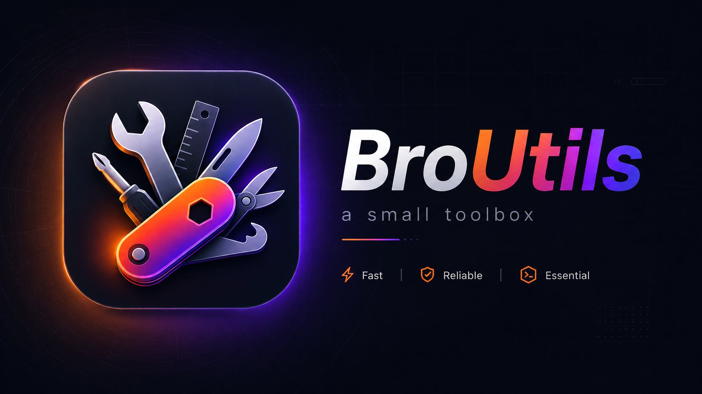

# BroUtils

A small native desktop toolbox built with Tauri v2 + React. Three tools in one app:

- **Bulk Rename** — rename a batch of files with find/replace or sequential numbering
- **Convert Images** — convert JPEG, PNG, WEBP, HEIC/HEIF, and more to any common format (AVIF, WebP, JPEG, PNG…)
- **Compress Videos** — batch-compress videos via a bundled FFmpeg sidecar with progress tracking and a finish notification

## Download

Pre-built binaries are attached to each [GitHub Release](https://github.com/HoshangDEV/broutils/releases/latest).

| Platform | File |
|---|---|
| macOS (Apple Silicon) | `BroUtils_x.x.x_aarch64.dmg` |
| Windows x64 | `BroUtils_x.x.x_x64-setup.exe` |

> macOS note: the app is not notarized yet. On first launch, right-click → Open to bypass Gatekeeper.

## Tech stack

| Layer | Tech |
|---|---|
| UI | React 19, TypeScript 5, Tailwind CSS 4, shadcn/ui |
| Desktop shell | Tauri v2 |
| Backend | Rust (image crate, libheif-rs, regex) |
| Video codec | FFmpeg sidecar (bundled binary) |
| Package manager | Bun |

## Prerequisites

- [Rust](https://rustup.rs/) (stable)
- [Bun](https://bun.sh/)
- **macOS only:** `brew install libheif` — required to build the HEIC/HEIF decoder
- The macOS ARM64 FFmpeg binary is committed. For a Windows build, fetch it first (see below).

## Getting started

```sh
# Install JS dependencies
bun install

# Start the dev app (Vite + Tauri, hot-reload on both sides)
bun run dev:tauri
```

> Do not use `bun run dev` alone — it starts only the Vite server without Tauri.

## Building

```sh
# Production build for the current platform
bun run build:tauri

# Cross-compile to Windows x86_64 (requires cargo-xwin)
bash scripts/download-ffmpeg-windows.sh   # fetch the ~200MB FFmpeg binary first
bun run build:tauri:windows
```

## Other commands

```sh
bun run types   # TypeScript type-check
bun run lint    # ESLint
```

## Project structure

```
src/
  components/
    bulk-rename.tsx       # Bulk Rename tab
    convert-images.tsx    # Convert Images tab
    compress-videos.tsx   # Compress Videos tab
    shared/               # Shared UI (DropZone, etc.)
  lib/
    rename.ts / convert.ts / compress.ts   # IPC wrappers
    files.ts              # basename, extensionOf, formatSize
    use-file-drop.ts      # Tauri drag-drop hook
src-tauri/
  src/
    lib.rs                # Tauri commands
    compress.rs           # FFmpeg sidecar logic
  binaries/               # FFmpeg sidecars
  capabilities/           # Tauri permission config
scripts/
  download-ffmpeg-windows.sh
```

## Contributing

1. Fork and clone
2. `bun install && bun run dev:tauri`
3. Open a PR — conventional commits preferred (`feat:`, `fix:`, `refactor:`, etc.)

## License

MIT
